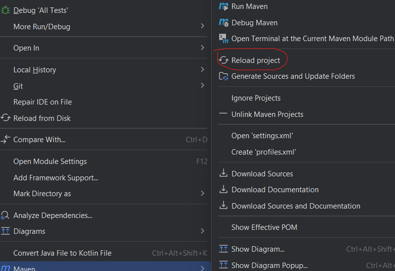

# genex-maven-plugin

This is a Maven plugin for automatically generating classes for a Spring Boot api service:
- Entity class
- Dto class
- Repository class (JPA Repository)
- Mapper class (Mapstruct)

It can also automatically add lombok and mapstruct dependencies to the project.

## Goals

| Goal                                            | Description                                      | Default Lifecycle Phase |
| ----------------------------------------------- | ------------------------------------------------ | ----------------------- |
| `genex:generate`                                | Generate classes                                 |       INITIALIZE        |
| `genex:add-lombok-mapstruct`                    | Add lombok and mapstruct dependencies to pom.xml |       INITIALIZE        |

## Requirements
- Maven 3.5.0
- Java 11

## Installation
#### 1. Include the plugin as a dependency in your Maven project. Inside build > plugins
```xml
<plugins>
  ...
  <plugin>
    <groupId>io.github.sam-wmd</groupId>
    <artifactId>genex-maven-plugin</artifactId>
    <version>1.0-SNAPSHOT</version>
  </plugin>
</plugins>
```
#### 2. Add the nexus repository to pom.xml
```xml
<repositories>
    <repository>
      <id>ossrh</id>
      <name>nexus-snapshot-repository</name>
      <url>https://s01.oss.sonatype.org/content/repositories/snapshots</url>
    </repository>
</repositories>
```
 
#### 3. Reload the project

   

#### 4. Add lombok and mapstruct dependencies (Optional)

You can do this manually or with this pre-built command:
    
` mvn genex:add-lombok-mapstruct `

## Usage
### Generating classes 
` mvn genex:generate -DentityName=Person -Dattributes='id:Long;username:String' -DdtoAttributes='username:String' `

#### Parameters
| Parameter                                            |           Usage                               |            Optional             |        Default value            | 
| ---------------------------------------------------- | --------------------------------------------- | ------------------------------- |---------------------------------|
| entityName                                           |` -DentityName=Person `                        |              False              | N/A
| attributes                                           |` -Dattributes='id:Long;username:String' `     |              False              | N/A
| dtoAttributes                                        |` -DdtoAttributes='username:String' `          |               True              | same as attributes
| entityId                                             |` -DentityId=username `                        |               True              | 'id' if the entity has an attribute named 'id' or else the entity's first attribute
| outputDir                                            |` -DoutputDir='src/main/java/...' `            |               True              |src/main/java/com/${groupId}
| generateMapper                                       |` -DgenerateMapper=true `                      |               True              | true
| generateRepository                                   |` -DgenerateRepository=true `                  |               True              | true

### Add Lombok and Mapstruct dependencies
`mvn genex:add-lombok-mapstruct`
